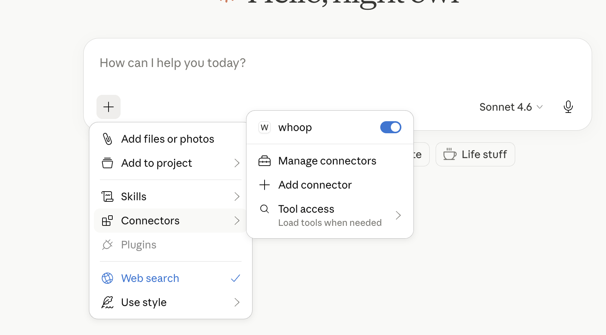
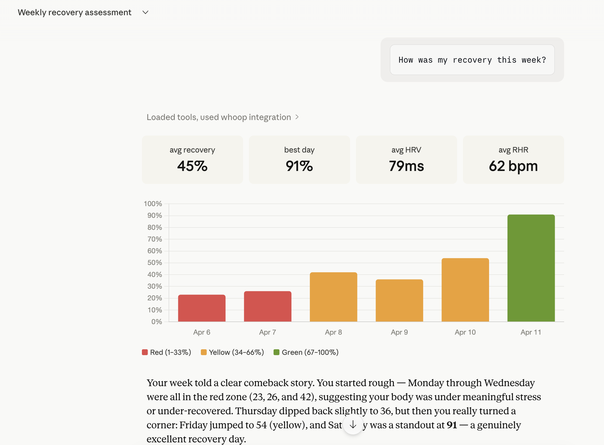

# whoop-ai-mcp

[](https://www.npmjs.com/package/whoop-ai-mcp)
[](https://opensource.org/licenses/MIT)
[](https://nodejs.org)

An [MCP (Model Context Protocol)](https://modelcontextprotocol.io/) server that connects AI assistants like Claude to your [WHOOP](https://www.whoop.com/) health and fitness data. Ask questions about your recovery, sleep, workouts, and more — all through natural conversation.

## Features

- 🏋️ **6 health data tools** — recovery, sleep, workouts, cycles, body measurements, and profile
- 🔐 **Secure OAuth2** — browser-based authentication with automatic token refresh
- 🔄 **Resilient** — automatic retry on rate limits, token refresh on expiry, clear error messages
- 💾 **Secure token storage** — tokens stored at `~/.whoop-mcp/tokens.json` with `0600` permissions
- ⚡ **Zero config** — just add your WHOOP app credentials and go
- 📦 **Lightweight** — only two runtime dependencies (`@modelcontextprotocol/sdk` + `zod`)

## Prerequisites

1. A [WHOOP](https://www.whoop.com/) account with an active membership
2. A WHOOP Developer App — create one at [developer.whoop.com](https://developer.whoop.com)
   - Set the redirect URI to `http://localhost:3000/callback`
3. [Node.js](https://nodejs.org/) >= 18

## Quickstart (Claude Desktop)

Add this to your Claude Desktop configuration file:

**macOS:** `~/Library/Application Support/Claude/claude_desktop_config.json`
**Windows:** `%APPDATA%\Claude\claude_desktop_config.json`

```json
{
  "mcpServers": {
    "whoop": {
      "command": "npx",
      "args": ["whoop-ai-mcp"],
      "env": {
        "WHOOP_CLIENT_ID": "your_client_id",
        "WHOOP_CLIENT_SECRET": "your_client_secret"
      }
    }
  }
}
```

Replace `your_client_id` and `your_client_secret` with the credentials from your [WHOOP Developer App](https://developer.whoop.com).

On first launch, a browser window will open for you to authorize access to your WHOOP data. After authorizing, tokens are cached locally and refresh automatically.

Then ask Claude something like:

> *"How was my recovery this week?"*
>
> *"Show me my sleep data from the last 3 days"*
>
> *"What workouts did I do this month?"*

**whoop-mcp connected in Claude Desktop:**



**Chatting with WHOOP data through Claude:**



## Installation

### Via npx (recommended)

No installation needed — Claude Desktop runs it automatically with the config above.

### Global install

```bash
npm install -g whoop-ai-mcp
```

### From source

```bash
git clone https://github.com/shashankswe2020-ux/whoop-mcp.git
cd whoop-mcp
npm install
npm run build
```

## Configuration

### Environment Variables

| Variable | Required | Description |
|----------|----------|-------------|
| `WHOOP_CLIENT_ID` | Yes | Your WHOOP Developer App client ID |
| `WHOOP_CLIENT_SECRET` | Yes | Your WHOOP Developer App client secret |

Set these in your Claude Desktop config (see [Quickstart](#quickstart-claude-desktop)) or as shell environment variables:

```bash
export WHOOP_CLIENT_ID=your_client_id
export WHOOP_CLIENT_SECRET=your_client_secret
```

### Creating a WHOOP Developer App

1. Go to [developer.whoop.com](https://developer.whoop.com)
2. Create a new application
3. Set the **Redirect URI** to `http://localhost:3000/callback`
4. Set the **Privacy Policy URL** (required by WHOOP) — you can use `https://github.com/shashankswe2020-ux/whoop-mcp` or your own URL
5. Enable the following scopes:
   - `read:profile`
   - `read:recovery`
   - `read:sleep`
   - `read:workout`
   - `read:cycles`
   - `read:body_measurement`
6. Copy the **Client ID** and **Client Secret**

## Tools

### `get_profile`

Get the authenticated user's basic profile — name and email.

**Parameters:** None

---

### `get_body_measurement`

Get the user's body measurements — height, weight, and max heart rate.

**Parameters:** None

---

### `get_recovery_collection`

Get recovery scores for a date range. Returns HRV, resting heart rate, SpO2, and skin temp for each day.

**Parameters:**

| Parameter | Type | Required | Description |
|-----------|------|----------|-------------|
| `start` | string | No | Return records after this time (inclusive). ISO 8601 format. |
| `end` | string | No | Return records before this time (exclusive). Defaults to now. |
| `limit` | number | No | Max records to return (1–25). Defaults to 10. |
| `nextToken` | string | No | Pagination token from a previous response. |

---

### `get_sleep_collection`

Get sleep records for a date range. Returns sleep stages, duration, respiratory rate, and performance scores.

**Parameters:**

| Parameter | Type | Required | Description |
|-----------|------|----------|-------------|
| `start` | string | No | Return records after this time (inclusive). ISO 8601 format. |
| `end` | string | No | Return records before this time (exclusive). Defaults to now. |
| `limit` | number | No | Max records to return (1–25). Defaults to 10. |
| `nextToken` | string | No | Pagination token from a previous response. |

---

### `get_workout_collection`

Get workout records for a date range. Returns strain, heart rate zones, calories, and sport type.

**Parameters:**

| Parameter | Type | Required | Description |
|-----------|------|----------|-------------|
| `start` | string | No | Return records after this time (inclusive). ISO 8601 format. |
| `end` | string | No | Return records before this time (exclusive). Defaults to now. |
| `limit` | number | No | Max records to return (1–25). Defaults to 10. |
| `nextToken` | string | No | Pagination token from a previous response. |

---

### `get_cycle_collection`

Get physiological cycles for a date range. Returns strain, calories, and heart rate data per cycle.

**Parameters:**

| Parameter | Type | Required | Description |
|-----------|------|----------|-------------|
| `start` | string | No | Return records after this time (inclusive). ISO 8601 format. |
| `end` | string | No | Return records before this time (exclusive). Defaults to now. |
| `limit` | number | No | Max records to return (1–25). Defaults to 10. |
| `nextToken` | string | No | Pagination token from a previous response. |

## Authentication

`whoop-ai-mcp` uses OAuth2 Authorization Code flow:

1. **First run:** A browser window opens for you to authorize with WHOOP
2. **Token caching:** Access and refresh tokens are saved to `~/.whoop-mcp/tokens.json`
3. **Auto-refresh:** When the access token expires, it's automatically refreshed using the stored refresh token
4. **Re-authentication:** If the refresh token expires, you'll be prompted to authorize again

Token files are stored with `0600` permissions (user-only read/write).

## Troubleshooting

### "Missing required environment variable: WHOOP_CLIENT_ID"

Your WHOOP credentials aren't set. Add them to your Claude Desktop config or set them as environment variables. See [Configuration](#configuration).

### "Network error: Unable to reach the WHOOP API"

Check your internet connection. The WHOOP API must be reachable at `https://api.prod.whoop.com`.

### "WHOOP API returned 429"

You've hit the rate limit. The server retries automatically with exponential backoff (up to 3 attempts). If this persists, reduce the frequency of your requests.

### "WHOOP API returned 401"

Your access token has expired. The server attempts an automatic refresh. If that fails, delete `~/.whoop-mcp/tokens.json` and restart to re-authenticate:

```bash
rm ~/.whoop-mcp/tokens.json
```

### Browser doesn't open during authentication

If the browser doesn't open automatically, check the terminal output for the authorization URL and open it manually.

## Testing with MCP Inspector

You can interactively test the server using the [MCP Inspector](https://github.com/modelcontextprotocol/inspector) — a browser-based tool for exploring and invoking MCP tools.

```bash
WHOOP_CLIENT_ID=your_client_id \
WHOOP_CLIENT_SECRET=your_client_secret \
WHOOP_REDIRECT_URI=http://localhost:3000/callback \
npx @modelcontextprotocol/inspector node dist/index.js
```

Then open `http://localhost:6274` in your browser. The Inspector connects to the server, lists all available tools, and lets you invoke them with custom parameters.

**OAuth grant access screen (first-run authorization):**


**Testing `get_profile` tool in MCP Inspector:**


## Development

### Setup

```bash
git clone https://github.com/shashankswe2020-ux/whoop-mcp.git
cd whoop-mcp
npm install
```

### Commands

| Command | Description |
|---------|-------------|
| `npm run build` | Build TypeScript |
| `npm test` | Run tests (Vitest) |
| `npm run typecheck` | Type check (`tsc --noEmit`) |
| `npm run lint` | Lint (ESLint) |
| `npm run lint:fix` | Lint + auto-fix |
| `npm run format` | Format (Prettier) |
| `npm run dev` | Run in dev mode (tsx) |

### Project Structure

```
src/
├── index.ts              # Entry point — auth, client, server, stdio
├── server.ts             # MCP server + tool registration
├── auth/
│   ├── oauth.ts          # OAuth2 Authorization Code flow
│   ├── token-store.ts    # Secure token persistence
│   └── callback-server.ts # Local OAuth callback server
├── api/
│   ├── client.ts         # HTTP client with retry + refresh
│   ├── types.ts          # WHOOP API response types
│   └── endpoints.ts      # API URL constants
└── tools/
    ├── get-profile.ts
    ├── get-recovery.ts
    ├── get-sleep.ts
    ├── get-workout.ts
    ├── get-cycle.ts
    ├── get-body-measurement.ts
    └── collection-utils.ts
```

## Releases & npm Package

This project is published on npm as [`whoop-ai-mcp`](https://www.npmjs.com/package/whoop-ai-mcp).

```bash
npm install -g whoop-ai-mcp
```

Or run directly with `npx`:

```bash
npx whoop-ai-mcp
```

### Release Process

1. Update the version in `package.json` and add a new entry in `CHANGELOG.md`
2. Commit the changes: `git commit -am "Release vX.Y.Z"`
3. Tag the release: `git tag vX.Y.Z`
4. Push the commit and tag: `git push origin main vX.Y.Z`
5. The [Release workflow](.github/workflows/release.yml) automatically creates a GitHub Release with notes extracted from the changelog
6. The [npm publish workflow](.github/workflows/npm-publish.yml) automatically publishes the new version to npm

### Changelog

See [CHANGELOG.md](CHANGELOG.md) for a full list of changes in each release.

## Contributing

See [CONTRIBUTING.md](CONTRIBUTING.md) for development workflow, coding conventions, and the project's Copilot agent/skill configuration.

## License

[MIT](LICENSE)
