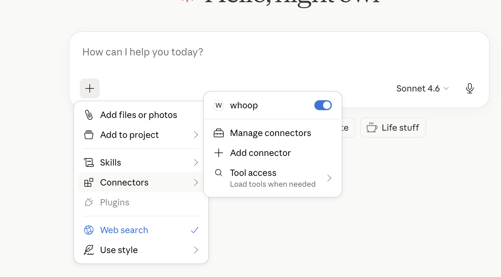
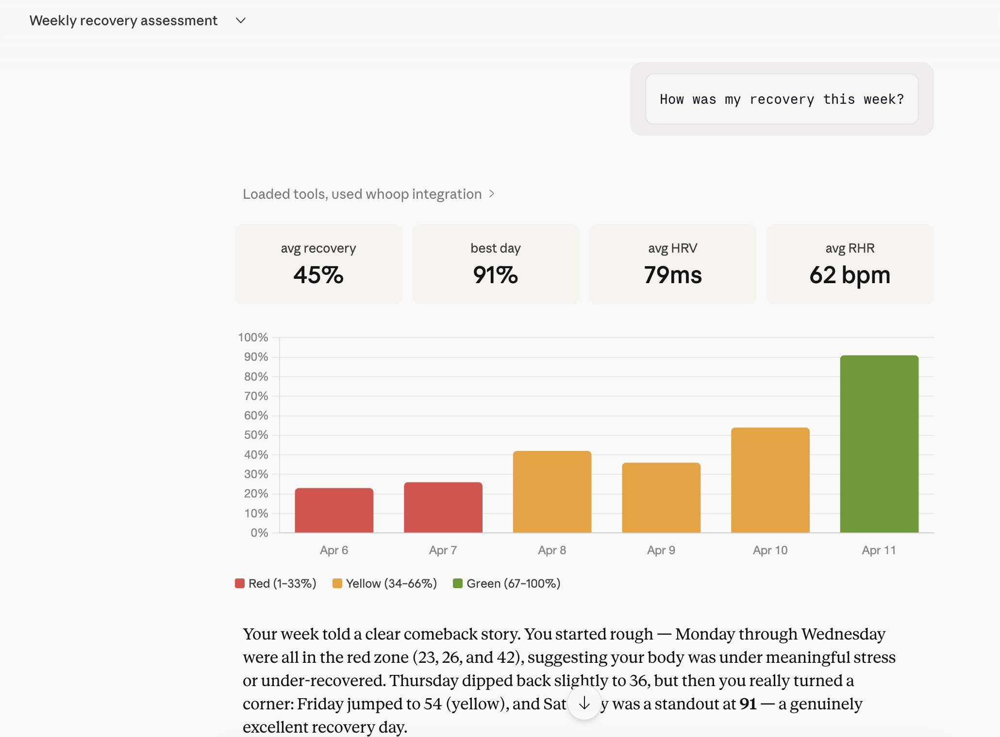

# whoop-ai-mcp

[](https://www.npmjs.com/package/whoop-ai-mcp)
[](https://www.npmjs.com/package/whoop-ai-mcp)
[](https://github.com/shashankswe2020-ux/whoop-mcp/stargazers)
[](https://opensource.org/licenses/MIT)
[](https://nodejs.org)
[](https://www.typescriptlang.org/)
[](https://modelcontextprotocol.io/)

[](https://registry.modelcontextprotocol.io/)

An [MCP (Model Context Protocol)](https://modelcontextprotocol.io/) server that connects AI assistants like Claude to your [WHOOP](https://www.whoop.com/) health and fitness data. Ask questions about your recovery, sleep, workouts, and more — all through natural conversation.

> 📦 **Published on the [MCP Registry](https://registry.modelcontextprotocol.io/)** as `io.github.shashankswe2020-ux/whoop` — discoverable by any MCP-compatible client.

## Features

> **0.7.0 — Trustworthy Personal Analytics:** Personal baselines, sleep debt,
> structured results, aggregate privacy and local diagnostics. See the
> [changelog](CHANGELOG.md#070---2026-09-10) and [release checklist](docs/plans/task-17-v070-trustworthy-personal-analytics.md).

- 🏋️ **16 health data tools** — recovery, sleep, workouts, cycles, body measurements, profile, summaries, trends, comparisons, record lookups, today's snapshot, calendar, personal baselines, and sleep debt
- 📊 **4 MCP Resources** — ambient health context (latest recovery, sleep, cycle, profile) available without explicit tool calls
- 💬 **5 MCP Prompts** — guided conversation starters for common health queries
- 📅 **Rich natural date expressions** — use "last 7 days", "this week", "last 2 weeks", "last 3 months", "this quarter", "last year", "2026-05", and more
- 📈 **Built-in analytics** — weekly summaries, trend detection (linear regression), and period comparisons computed server-side
- **Personal analytics (0.7.0)** — personal baseline distributions and sleep deficits with sample counts, missing-data safeguards and bounded output
- **Structured results (0.7.0)** — output schemas and matching JSON-text results for all tools
- **Aggregate privacy (0.7.0)** — five allowlisted tools, no raw resources/prompts, and no caller override of the process policy
- **Local diagnostics (0.7.0)** — `doctor` checks configuration and token-file metadata without network or OAuth activity
- 🔐 **Secure OAuth2** — browser-based authentication with automatic token refresh
- 🔄 **Resilient** — automatic retry on rate limits, token refresh on expiry, auto-pagination, clear error messages
- 💾 **Secure token storage** — tokens stored at `~/.whoop-mcp/tokens.json` with `0600` permissions
- ⚡ **Zero config** — just add your WHOOP app credentials and go
- 📦 **Lightweight** — only two runtime dependencies (`@modelcontextprotocol/sdk` + `zod`)

## SOTA scan (WHOOP MCP packages on npm)

_Registry snapshot collected 2026-08-30. Versions and publish dates can change;
this is an ecosystem comparison, not a source-code security audit._

| Package | Latest | Published (UTC) | MCP Registry identity | Runtime deps | Notable signals |
|------|------:|-----------------|----------------------|-------------:|-----------------|
| **whoop-ai-mcp (this repo)** | **0.6.1** | 2026-08-07 | **✅ `io.github.shashankswe2020-ux/whoop`** | **2** | 14 tools, 4 resources, 5 prompts, analytics, HTTP + stdio, OAuth 2.1 connector |
| whoop-mcp-unofficial | 0.6.5 | 2026-08-29 | ✅ `io.github.davidmosiah/whoop-mcp` | 6 | 20+ tools, SQLite cache, privacy modes |
| mcp-server-whoop | 0.2.2 | 2026-07-17 | ✅ `io.github.Yadheedhya06/mcp-server-whoop` | 2 | Read-only/local-first, npm provenance, SBOM and security checks |
| @souravpn/whoop-mcp | 1.0.2 | 2026-05-27 | ✅ `io.github.souravpn/whoop-mcp` | 1 | Simple standalone server with OAuth setup |
| @nchemb/whoop-mcp | 0.2.0 | 2026-04-27 | — | 4 | Shared OAuth relay and local SQLite cache |
| whoop-mcp-server | 0.0.5 | 2026-03-13 | — | 2 | WHOOP Developer Platform API server |
| whoop-mcp | 0.1.2 | 2026-03-11 | — | 1 | Server built with the `xmcp` framework |
| @roebot0/whoop-mcp | 1.0.0 | 2026-04-06 | — | 3 | Axios-based server and separate auth command |
| @alacore/whoop-mcp-server | 1.0.1 | 2025-10-09 | — | 2 | API v2 integration; requires pnpm |

**Findings**

- MCP Registry discoverability is now table stakes: at least three alternatives also
  publish `mcpName` identities.
- The leading portability trade-off remains local-first/no-infrastructure
  operation versus richer remote hosting, caching, or relay features.
- Current best practice is to document security controls, test/verification
  commands, provenance or SBOM metadata, and the exact transport/auth model.
  This project provides the first two and supports both local stdio and
  authenticated Streamable HTTP; it does not claim to be a security audit.

**Published 0.6.1 strengths**

- 14 domain and analytical tools, 4 ambient resources, and 5 prompts in one
  standalone package.
- No database, relay service, or framework runtime dependency; only the MCP SDK
  and Zod are required.
- Published to npm and the official MCP Registry, with documented OAuth,
  token refresh, retries, caching, HTTP hardening, and Inspector verification.

The table above is the historical August 30 snapshot, so its 14-tool count is intentional.
Version 0.7.0 adds two tools; its scope and evidence are in the
[September feature scan](docs/ideas/sota-feature-scan-2026-09-10.md).

**Evidence and reproducibility:** package names, versions, publish dates,
dependency counts, descriptions, and `mcpName` values come from the npm Registry
search and package manifests. Feature notes were checked against each package's
published metadata/README where available. Re-run the scan with:

```bash
curl -s 'https://registry.npmjs.org/-/v1/search?text=whoop%20mcp&size=20'
```

## 🎥 Video Walkthrough

Watch a detailed walkthrough of setting up and using whoop-ai-mcp with Claude Desktop:

[](https://youtu.be/2vwxEjctcWs?si=ncIr0fmXT0MUarYL)

> Covers: creating a WHOOP Developer App, configuring Claude Desktop, OAuth authentication, and querying your health data through natural conversation.

## Prerequisites

1. A [WHOOP](https://www.whoop.com/) account with an active membership
2. A WHOOP Developer App — create one at [developer.whoop.com](https://developer.whoop.com)
   - Set the redirect URI to `http://localhost:3000/callback`
3. [Node.js](https://nodejs.org/) >= 20

## Get a WHOOP

Don't have a WHOOP yet? Here's how to get started:

- 🛒 **Buy a WHOOP on Amazon** — [WHOOP peak on Amazon](https://amzn.to/4st9B2r)
- 🔗 **Join WHOOP directly** — [whoop.com/membership](https://join.whoop.com/63E6C805)

## Quickstart (MCP Registry)

This server is published on the official [MCP Registry](https://registry.modelcontextprotocol.io/). MCP clients that support the registry can discover and install it automatically:

```
Server name: io.github.shashankswe2020-ux/whoop
```

You can also browse it via the registry API:

```bash
curl "https://registry.modelcontextprotocol.io/v0.1/servers?search=io.github.shashankswe2020-ux/whoop"
```

## Quickstart (Claude Desktop)

Add this to your Claude Desktop configuration file:

**macOS:** `~/Library/Application Support/Claude/claude_desktop_config.json`
**Windows:** `%APPDATA%\Claude\claude_desktop_config.json`

```json
{
  "mcpServers": {
    "whoop": {
      "command": "npx",
      "args": ["whoop-ai-mcp"],
      "env": {
        "WHOOP_CLIENT_ID": "your_client_id",
        "WHOOP_CLIENT_SECRET": "your_client_secret"
      }
    }
  }
}
```

Replace `your_client_id` and `your_client_secret` with the credentials from your [WHOOP Developer App](https://developer.whoop.com).

On first launch, a browser window will open for you to authorize access to your WHOOP data. After authorizing, tokens are cached locally and refresh automatically.

Then ask Claude something like:

> *"How am I doing today?"*
>
> *"Show me my sleep data from the last 3 days"*
>
> *"What workouts did I do this month?"*
>
> *"Is my HRV trending up or down?"*
>
> *"Give me a weekly health summary"*
>
> *"Show me my recovery calendar for last 2 weeks"*

**whoop-mcp connected in Claude Desktop:**



**Chatting with WHOOP data through Claude:**



**Weekly Health Report demo (Claude Desktop):**


## Installation

### Via npx (recommended)

No installation needed — Claude Desktop runs it automatically with the config above.

### Global install

```bash
npm install -g whoop-ai-mcp
```

### From source

```bash
git clone https://github.com/shashankswe2020-ux/whoop-mcp.git
cd whoop-mcp
npm install
npm run build
```

### Setup wizard (`whoop-ai-mcp setup`)

For a guided installation that writes the Claude Desktop config (or prints the
registration command for Claude Code, Codex, or GitHub Copilot) and verifies
your WHOOP credentials in one go:

```bash
npx whoop-ai-mcp setup
```

Flags:

- `--client=claude-desktop` (default) writes/merges `claude_desktop_config.json`
  with an automatic `.bak` backup.
- `--client=claude-code` prints the equivalent `claude mcp add` command.
- `--client=codex` prints the equivalent `codex mcp add` command (registers the
  server in `~/.codex/config.toml`).
- `--client=copilot` prints the equivalent `code --add-mcp` command for GitHub
  Copilot in VS Code.
- `--verify` runs the OAuth flow end-to-end and fetches your profile to confirm
  everything is wired correctly before exiting.
- `--client-id` / `--client-secret` skip the interactive prompts (useful for
  scripts; secrets entered interactively are masked).

If `WHOOP_CLIENT_ID` and `WHOOP_CLIENT_SECRET` are already exported in your
shell, the wizard uses them automatically — no prompts. Combine with
`--verify` to do a one-shot config-correctness check:

```bash
WHOOP_CLIENT_ID=... WHOOP_CLIENT_SECRET=... npx whoop-ai-mcp setup --verify
```

If the Claude Desktop config file already contains a `whoop` MCP entry from
a previous setup, the wizard short-circuits — it reads the existing
credentials, prints `Existing whoop entry found in <path>`, and either
verifies them (with `--verify`) or exits without rewriting the file. To
overwrite an existing entry, pass explicit `--client-id` / `--client-secret`
flags.

Precedence: `--client-id` / `--client-secret` flags > existing claude-desktop
config > `WHOOP_CLIENT_ID` / `WHOOP_CLIENT_SECRET` env vars > interactive
prompts.

Example session:

```text
shashankmishra@Shashanks-MacBook-Pro ~ % npx whoop-ai-mcp setup --client=claude-desktop
WHOOP MCP — Setup Wizard
------------------------

WHOOP Client ID (from https://developer.whoop.com): xxxxxxxx-xxxx-xxxx-xxxx-xxxxxxxxxxxx
WHOOP Client Secret (input hidden): ****************************************************************

Claude Desktop config written: /Users/shashankmishra/Library/Application Support/Claude/claude_desktop_config.json
Previous config backed up to: /Users/shashankmishra/Library/Application Support/Claude/claude_desktop_config.json.bak
Restart Claude Desktop to load the new server.
```

Re-running against an already-configured Claude Desktop install (existing
`whoop` entry in `claude_desktop_config.json`) short-circuits to a
verification-only flow — no prompts, no rewrite:

```text
shashankmishra@Shashanks-MacBook-Pro ~ % whoop-ai-mcp setup --verify
WHOOP MCP — Setup Wizard
------------------------

Target client (claude-desktop / claude-code) [claude-desktop]:
Existing whoop entry found in /Users/shashankmishra/Library/Application Support/Claude/claude_desktop_config.json.

Verifying credentials with WHOOP...
Cached tokens expired, attempting refresh...
Token refresh successful.
OAuth flow complete. Fetching profile...
Profile OK: {"user_id":35253045,"email":"shashank.swe.2020@gmail.com","first_name":"Shashank","last_name":"Mishra"}

Existing config verified — no changes made.
```

## Configuration

### Environment Variables

| Variable | Required | Description |
|----------|----------|-------------|
| `WHOOP_CLIENT_ID` | Yes | Your WHOOP Developer App client ID |
| `WHOOP_CLIENT_SECRET` | Yes | Your WHOOP Developer App client secret |

Set these in your Claude Desktop config (see [Quickstart](#quickstart-claude-desktop)) or as shell environment variables:

```bash
export WHOOP_CLIENT_ID=your_client_id
export WHOOP_CLIENT_SECRET=your_client_secret
```

### Creating a WHOOP Developer App

1. Go to [developer.whoop.com](https://developer.whoop.com)
2. Create a new application
3. Set the **Redirect URI** to `http://localhost:3000/callback`
4. Set the **Privacy Policy URL** (required by WHOOP) — you can use `https://github.com/shashankswe2020-ux/whoop-mcp` or your own URL
5. Enable the following scopes:
   - `read:profile`
   - `read:recovery`
   - `read:sleep`
   - `read:workout`
   - `read:cycles`
   - `read:body_measurement`
6. Copy the **Client ID** and **Client Secret**

## Tools

### `get_profile`

Get the authenticated user's basic profile — name and email.

**Parameters:** None

---

### `get_body_measurement`

Get the user's body measurements — height, weight, and max heart rate.

**Parameters:** None

---

### `get_recovery_collection`

Get recovery scores for a date range. Returns HRV, resting heart rate, SpO2, and skin temp for each day.

**Parameters:**

| Parameter | Type | Required | Description |
|-----------|------|----------|-------------|
| `start` | string | No | ISO 8601 or relative expression ("today", "last 7 days", "this week"). |
| `end` | string | No | ISO 8601 or relative expression. Defaults to now. |
| `limit` | number | No | Max records to return (1–25). Defaults to 10. |
| `nextToken` | string | No | Pagination token from a previous response. |

---

### `get_sleep_collection`

Get sleep records for a date range. Returns sleep stages, duration, respiratory rate, and performance scores.

**Parameters:**

| Parameter | Type | Required | Description |
|-----------|------|----------|-------------|
| `start` | string | No | ISO 8601 or relative expression ("today", "last 7 days", "this week"). |
| `end` | string | No | ISO 8601 or relative expression. Defaults to now. |
| `limit` | number | No | Max records to return (1–25). Defaults to 10. |
| `nextToken` | string | No | Pagination token from a previous response. |

---

### `get_workout_collection`

Get workout records for a date range. Returns strain, heart rate zones, calories, and sport type.

**Parameters:**

| Parameter | Type | Required | Description |
|-----------|------|----------|-------------|
| `start` | string | No | ISO 8601 or relative expression ("today", "last 7 days", "this week"). |
| `end` | string | No | ISO 8601 or relative expression. Defaults to now. |
| `limit` | number | No | Max records to return (1–25). Defaults to 10. |
| `nextToken` | string | No | Pagination token from a previous response. |

---

### `get_cycle_collection`

Get physiological cycles for a date range. Returns strain, calories, and heart rate data per cycle.

**Parameters:**

| Parameter | Type | Required | Description |
|-----------|------|----------|-------------|
| `start` | string | No | ISO 8601 or relative expression ("today", "last 7 days", "this week"). |
| `end` | string | No | ISO 8601 or relative expression. Defaults to now. |
| `limit` | number | No | Max records to return (1–25). Defaults to 10. |
| `nextToken` | string | No | Pagination token from a previous response. |

---

### `get_sleep_by_id`

Get a single sleep record by ID. Returns sleep stages, duration, respiratory rate, and performance scores.

**Parameters:**

| Parameter | Type | Required | Description |
|-----------|------|----------|-------------|
| `id` | string | Yes | The sleep record ID. |

---

### `get_workout_by_id`

Get a single workout record by ID. Returns strain, heart rate zones, calories, and sport type.

**Parameters:**

| Parameter | Type | Required | Description |
|-----------|------|----------|-------------|
| `id` | string | Yes | The workout record ID. |

---

### `get_cycle_by_id`

Get a single physiological cycle by ID. Returns strain, calories, and heart rate data.

**Parameters:**

| Parameter | Type | Required | Description |
|-----------|------|----------|-------------|
| `id` | number | Yes | The cycle record ID. |

---

### `get_weekly_summary`

Get a summarized health report for a given week — average recovery, HRV, RHR, sleep duration and quality, workout count and strain, plus recovery trend direction.

**Parameters:**

| Parameter | Type | Required | Description |
|-----------|------|----------|-------------|
| `week_start` | string | No | ISO 8601 or relative expression ("last week", "this week"). Defaults to most recent Monday. |

---

### `compare_periods`

Compare health metrics between two time periods — shows improvement or regression in recovery, sleep, and strain.

**Parameters:**

| Parameter | Type | Required | Description |
|-----------|------|----------|-------------|
| `period_a_start` | string | Yes | ISO 8601 start of the first period. |
| `period_a_end` | string | Yes | ISO 8601 end of the first period. |
| `period_b_start` | string | Yes | ISO 8601 start of the second period. |
| `period_b_end` | string | Yes | ISO 8601 end of the second period. |

---

### `get_trend`

Analyze a health metric trend over time — detects direction (improving/declining/stable), variability, and anomalies using linear regression.

**Parameters:**

| Parameter | Type | Required | Description |
|-----------|------|----------|-------------|
| `metric` | string | Yes | One of: `recovery`, `hrv`, `rhr`, `sleep_duration`, `sleep_performance`, `strain`. |
| `days` | number | No | Number of days to analyze (7–90). Default: 30. |

---

### `get_today`

Get today's complete health snapshot — recovery score, last night's sleep, current strain, and last workout in one call. Perfect for "how am I doing today?" questions.

**Parameters:** None

**Returns:** Recovery score with zone, sleep breakdown (hours, stages, performance), current strain, last workout (sport + strain), and a human-readable summary.

Recovery is returned only when it matches the current local cycle and primary sleep.
Pending or invalid primary sleep never falls back to an older recovery. Missing optional
sleep percentages are `null`, not zero. `data_quality` distinguishes missing, pending,
stale, unscored, calibrating, invalid and failed sources; cache status and fetch time
remain unknown when the client cannot establish them.

For compatibility, `sleep.total_hours` remains time in bed. Use `time_in_bed_hours`
or `asleep_hours` explicitly; summaries now use scored asleep stages. The latest
workout includes `occurred_at` and recording percentage and may be historical.

---

### `get_baselines`

Returns personal distributions for HRV, resting heart rate, respiratory rate,
asleep hours and recovery score. `baseline_days` is an integer from 14 to 180
(default 30). Each band includes mean, median, standard deviation, percentiles,
sample size and the latest observation's midrank percentile.

The latest observation and current local day are excluded from each baseline.
Calibrating, unscored, invalid and unjoinable observations are excluded. A metric
needs 14 historical points after exclusions; otherwise its band is null with an
insufficient-data status. Constant distributions are labeled explicitly.

### `get_sleep_debt`

Analyzes scored main sleeps using `days` (3-90, default 14) and optional `start`
(ISO or a supported relative expression). With `start`, the window extends forward
for `days` calendar days, clamped to evaluation time. Resolved bounds are returned.

`total_debt_hours` sums observed nightly deficits. Need excludes WHOOP's accumulated
debt component and preserves the signed nap adjustment; achieved sleep is light +
slow-wave + REM. `standing_debt_hours` is the latest WHOOP debt value, separately
dated, not the deficit sum. Missing nights are not zero-sleep nights; fewer than
three usable nights returns null aggregates. Circular local-clock statistics describe
consistency and heuristic social jetlag, not clinical diagnoses or recovery forecasts.

Analytics paginate up to 500 records per source and report upstream truncation.
Sleep-debt calculations use all selected records but echo at most 30 nights, with
a separate `output_capped` flag. Both tools include a statistical/medical disclaimer.

### `get_calendar`

Get a day-by-day grid of recovery, sleep, and strain for a date range. Perfect for weekly/monthly overviews.

**Parameters:**

| Parameter | Type | Required | Description |
|-----------|------|----------|-------------|
| `days` | number | No | Number of days to show (1–90). Default: 7. |
| `start` | string | No | Start date — ISO 8601 or relative expression ("last 14 days", "this month"). Defaults to N days ago. |

**Returns:** Per-day grid with recovery score + zone (green/yellow/red), sleep hours, sleep performance, and strain. Includes period averages.

---

## Structured Results And Privacy

All tools advertise `outputSchema` and return validated `structuredContent` alongside
equivalent JSON text for older clients. Provider bodies and internal error details
are not returned in tool or resource errors.

Set `WHOOP_MCP_PRIVACY_MODE=aggregate` in the server process environment to expose
only `get_weekly_summary`, `compare_periods`, `get_trend`, `get_baselines`, and
`get_sleep_debt`. Per-record arrays, latest observations, standing debt, identity
fields and exact activity timestamps are omitted. Period bounds are date-only.
Raw resources and all five existing prompts are unavailable in this mode because
their workflows require raw tools/resources. Tool arguments cannot override the policy.

The default is `standard`, retaining all 16 tools, four resources and five prompts.
The standard-mode resource and prompt lists later in this README do not apply to
aggregate mode. To enable aggregation in a client configuration, add
`"WHOOP_MCP_PRIVACY_MODE": "aggregate"` to the server's existing `env` object.
Restart and reconnect after changing the process policy. Aggregate mode minimizes
disclosure; it is not anonymization, does not erase previously shared data, and
still sends health aggregates to the assistant provider.

`get_today` and the two new analytics tools use recorded offsets for local-day
attribution. Existing calendar and weekly-summary grouping remains UTC for compatibility.
An offset is not a timezone database and cannot reconstruct within-sleep DST changes.

## Local Diagnostics

For a local build:

```sh
npm ci --ignore-scripts
npm run build
node dist/index.js doctor --json
```

With 0.7.0 installed, use `whoop-ai-mcp doctor` or
`whoop-ai-mcp doctor --json` directly. The command is not present in 0.6.1.

Checks runtime, configuration presence, privacy/transport settings and token-file
metadata without reading token contents, calling WHOOP, launching OAuth or writing
files. Exit codes: 0 = locally ready, 1 = remediation needed, 2 = invalid arguments.
Token validity and granted scopes remain unknown; `setup --verify` is the explicit
live check. POSIX private permissions are checked; Windows ACL privacy is not verified.

---

## Supported Date Expressions

All collection tools and `get_calendar` accept natural language date expressions (case-insensitive):

| Expression | Example Result |
|------------|----------------|
| `"today"` | Today's UTC day boundaries |
| `"yesterday"` | Yesterday's UTC day boundaries |
| `"last N days"` (1–365) | N days back from today |
| `"last N weeks"` (1–52) | N×7 days back from today |
| `"last N months"` (1–12) | N calendar months back |
| `"this week"` | Monday to today |
| `"last week"` | Previous Monday–Sunday |
| `"this month"` | 1st of month to today |
| `"last month"` | Full previous month |
| `"this quarter"` | Quarter start (Jan/Apr/Jul/Oct) to today |
| `"last quarter"` | Full previous quarter |
| `"last year"` | Jan 1–Dec 31 of previous year |
| `"YYYY-MM"` (e.g., `"2026-05"`) | Full calendar month |
| ISO 8601 | Pass-through (e.g., `"2026-03-15T00:00:00Z"`) |

---

## Resources

MCP Resources provide ambient health context — AI assistants can read your current health state without explicit tool calls.

| Resource URI | Description | Cache TTL |
|--------------|-------------|-----------|
| `whoop://v2/user/recovery/latest` | Most recent recovery score, HRV, RHR | 5 min |
| `whoop://v2/user/sleep/latest` | Most recent sleep record | 5 min |
| `whoop://v2/user/cycle/latest` | Current physiological cycle (strain) | 2 min |
| `whoop://v2/user/profile` | User profile (name, email) | 1 hr |

**Privacy:** Resources expose the same data available through tools — they simply make it accessible as ambient context. No additional WHOOP scopes are required. Data is cached in-memory with short TTLs and invalidated on token refresh.

To disable resources: set `WHOOP_MCP_DISABLE_RESOURCES=1`.

---

## Caching

Read requests can be served from a shared in-memory cache (LRU + TTL) to cut
redundant WHOOP API calls and improve latency. The same cache backs both MCP
resources and tools such as `get_today`, so a warm cache answers repeat queries
without hitting the API.

| Data | TTL |
|------|-----|
| Profile | 1 hr |
| Recovery, Sleep | 5 min |
| Cycle | 2 min |
| Collections (date-range queries) | Uncached |

- Cache keys are normalized by request path with sorted query params; **no tokens are ever part of a cache key**.
- Concurrent identical requests are de-duplicated (single in-flight fetch — stampede prevention).
- The entire cache is cleared on token refresh.

---

## Write Operations

The server is **read-only today** — WHOOP does not currently expose public write
endpoints, so no write tools are registered. The codebase ships a
*future-ready* write-safety pattern (`withPreview()`) so that mutations, if WHOOP
adds them, follow a safe two-phase flow:

1. **Preview** (`confirm: false`) — returns a `WritePreview` describing exactly
   what would change, plus a generated `idempotency_key`. Nothing is written.
2. **Confirm** (`confirm: true`) — executes the write and returns a
   `WriteReceipt` carrying the same `idempotency_key`, so retried confirms never
   create duplicate records.

This gives an AI assistant a built-in "show me before you do it" checkpoint and
makes retries safe by construction. See [src/tools/write-safety.ts](src/tools/write-safety.ts).

---

## Prompts

Pre-built conversation starters that guide you into useful health queries:

| Prompt | Description |
|--------|-------------|
| `weekly_health_review` | Comprehensive review of recovery, sleep, and workouts (accepts optional `days` arg) |
| `sleep_analysis` | Analyze recent sleep patterns and quality |
| `recovery_trend` | How is recovery trending? HRV, RHR, recovery score analysis |
| `workout_recap` | Summarize recent workouts, strain, and training load |
| `health_check` | Quick health status using cached resource data |

## Authentication

`whoop-ai-mcp` uses OAuth2 Authorization Code flow with PKCE:

1. **First run:** A browser window opens for you to authorize with WHOOP
2. **Token caching:** Access and refresh tokens are saved to `~/.whoop-mcp/tokens.json`
3. **Auto-refresh:** When the access token expires, it's automatically refreshed using the stored refresh token
4. **Re-authentication:** If the refresh token expires, you'll be prompted to authorize again

Token files are stored with `0600` permissions (user-only read/write).

## Troubleshooting

### "Missing required environment variable: WHOOP_CLIENT_ID"

Your WHOOP credentials aren't set. Add them to your Claude Desktop config or set them as environment variables. See [Configuration](#configuration).

### "Network error: Unable to reach the WHOOP API"

Check your internet connection. The WHOOP API must be reachable at `https://api.prod.whoop.com`.

### "WHOOP API returned 429"

You've hit the rate limit. The server retries automatically with exponential backoff (up to 3 attempts). If this persists, reduce the frequency of your requests.

### "WHOOP API returned 401"

Your access token has expired. The server attempts an automatic refresh. If that fails, delete `~/.whoop-mcp/tokens.json` and restart to re-authenticate:

```bash
rm ~/.whoop-mcp/tokens.json
```

### Browser doesn't open during authentication

If the browser doesn't open automatically, check the terminal output for the authorization URL and open it manually.

## Testing with MCP Inspector

You can interactively test the server using the [MCP Inspector](https://github.com/modelcontextprotocol/inspector) — a browser-based tool for exploring and invoking MCP tools.

```bash
WHOOP_CLIENT_ID=your_client_id \
WHOOP_CLIENT_SECRET=your_client_secret \
WHOOP_REDIRECT_URI=http://localhost:3000/callback \
npx @modelcontextprotocol/inspector node dist/index.js
```

Then open `http://localhost:6274` in your browser. The Inspector connects to the server, lists all available tools, and lets you invoke them with custom parameters.

**OAuth grant access screen (first-run authorization):**


**Testing `get_profile` tool in MCP Inspector:**


## Deployment (Docker + Cloud Hosting)

The HTTP transport (`MCP_TRANSPORT=http`) makes this server suitable for remote
hosting so that web/mobile MCP clients (e.g. claude.ai connectors) can connect
to your personal WHOOP data over the network. A production-ready
[Dockerfile](Dockerfile) is included.

> **Security warning.** When running over HTTP you are exposing your WHOOP data
> behind a single bearer token. Use a strong random `MCP_AUTH_TOKEN`
> (`openssl rand -hex 32`), only deploy behind TLS, restrict
> `MCP_ALLOWED_ORIGINS`, and treat the host as a personal-use deployment — not
> a multi-tenant service.

### Image characteristics

- Multi-stage build on `node:22-alpine` (compressed pull size **~58 MB**;
  uncompressed ~258 MB — the floor is set by the Node.js runtime itself).
- Runs as the unprivileged built-in `node` user (UID 1000).
- `tini` as PID 1 for clean signal forwarding (graceful shutdown).
- Health check uses Node's native `fetch` against `/health` — no `curl`/`wget`
  baked into the image.
- All configuration is supplied at runtime via env vars; no secrets are baked
  into image layers.

### Build & run locally

```bash
docker build -t whoop-mcp .

# Smoke test (runs node, prints "ok", exits)
docker run --rm whoop-mcp node -e "console.log('ok')"

# Run the HTTP server
docker run --rm -p 3000:3000 \
  -e MCP_AUTH_TOKEN="$(openssl rand -hex 32)" \
  -e WHOOP_CLIENT_ID="your-client-id" \
  -e WHOOP_CLIENT_SECRET="your-client-secret" \
  -e MCP_ALLOWED_ORIGINS="https://claude.ai" \
  whoop-mcp

# Health check
curl http://localhost:3000/health
```

Required env vars (HTTP mode):

| Variable                | Required | Default      | Notes                                                       |
| ----------------------- | -------- | ------------ | ----------------------------------------------------------- |
| `MCP_TRANSPORT`         | no       | `http`       | Image default; override with `stdio` or `both` if needed.   |
| `MCP_AUTH_TOKEN`        | **yes**  | —            | Bearer token clients must send. Generate ≥32 random bytes.  |
| `WHOOP_CLIENT_ID`       | **yes**  | —            | From your WHOOP developer app.                              |
| `WHOOP_CLIENT_SECRET`   | **yes**  | —            | From your WHOOP developer app.                              |
| `MCP_PORT`              | no       | `3000`       | Listen port.                                                |
| `MCP_HOST`              | no       | `0.0.0.0`    | Listen interface.                                           |
| `MCP_ALLOWED_ORIGINS`   | no       | (none)       | Comma-separated CORS allowlist.                             |
| `MCP_TRUST_PROXY`       | no       | `0`          | Set `1` when behind a reverse proxy (Fly/Railway).          |
| `LOG_LEVEL`             | no       | `info`       | `debug`/`info`/`warn`/`error`.                              |
| `LOG_FORMAT`            | no       | `json`       | `json` for prod, `pretty` for local dev.                    |
| `MCP_CONNECTOR_PASSWORD`| no       | —            | If set (≥12 chars), enables the OAuth 2.1 connector for claude.ai web/mobile. Requires `PUBLIC_URL` + `ALLOWED_REDIRECT_URIS`. |
| `PUBLIC_URL`            | no       | —            | Public `https://` origin used as OAuth issuer.              |
| `ALLOWED_REDIRECT_URIS` | no       | —            | Comma-separated exact-match list of OAuth redirect URIs.    |
| `MCP_JWT_SECRET`        | no       | (HKDF)       | Override JWT signing key. Defaults to HKDF derivation from `MCP_AUTH_TOKEN`. |
| `MCP_OAUTH_CLIENT_ID`   | no       | `whoop-mcp-connector` | OAuth client identifier advertised by the connector. |

### Fly.io

[Fly.io](https://fly.io) deploys directly from the Dockerfile and gives you a
free TLS-terminated public URL.

```bash
# One-time: install flyctl, sign in, and create the app from this repo's Dockerfile
brew install flyctl
fly auth login
fly launch --no-deploy --copy-config --name whoop-mcp-<your-suffix>

# Set secrets (these are encrypted and injected as env at runtime — never baked in)
fly secrets set \
  MCP_AUTH_TOKEN="$(openssl rand -hex 32)" \
  WHOOP_CLIENT_ID="..." \
  WHOOP_CLIENT_SECRET="..." \
  MCP_TRUST_PROXY=1

# Deploy
fly deploy
fly status
fly logs
```

In your generated `fly.toml`, make sure the HTTP service points at port 3000
and that `force_https = true` is set under `[[http_service]]`. Fly handles
TLS termination, so `MCP_TRUST_PROXY=1` is required for accurate client IPs
in logs and rate-limit decisions.

### Railway

[Railway](https://railway.app) auto-detects the Dockerfile.

1. Create a new project from this GitHub repo (or `railway up` from a clone).
2. In **Variables**, add `MCP_AUTH_TOKEN`, `WHOOP_CLIENT_ID`,
   `WHOOP_CLIENT_SECRET`, and `MCP_TRUST_PROXY=1`.
3. Under **Settings → Networking**, generate a public domain. Railway
   terminates TLS for you.
4. Deploy. Health check path: `/health`.

### Other platforms

The image is a stock OCI artifact and runs anywhere Docker does — Render, Cloud
Run, Kubernetes, Hetzner, etc. The only platform-specific knob is
`MCP_TRUST_PROXY=1` whenever you sit behind a TLS-terminating proxy.

### Connecting from claude.ai (OAuth 2.1 connector)

Claude Desktop and Claude Code can use the static `MCP_AUTH_TOKEN` bearer
directly. The **claude.ai web/mobile** clients expect an OAuth 2.1 connector
with PKCE — set the three env vars below and the server mounts the connector
automatically on the same port as `/mcp`:

```bash
fly secrets set \
  MCP_CONNECTOR_PASSWORD="$(openssl rand -base64 24)" \
  PUBLIC_URL="https://whoop-mcp-<your-suffix>.fly.dev" \
  ALLOWED_REDIRECT_URIS="https://claude.ai/api/mcp/auth_callback"
```

- `MCP_CONNECTOR_PASSWORD` (≥12 chars) — the human-facing password you'll type
  into the claude.ai connector dialog. Treat it like any other shared secret.
- `PUBLIC_URL` — the public `https://` origin claude.ai will reach. Used as
  the OAuth issuer (e.g. `https://example.com` → metadata at
  `/.well-known/oauth-authorization-server`).
- `ALLOWED_REDIRECT_URIS` — comma-separated **exact-match** allowlist. For
  claude.ai the value is `https://claude.ai/api/mcp/auth_callback`.
- Optional: `MCP_JWT_SECRET` overrides the JWT signing key (defaults to an
  HKDF derivation from `MCP_AUTH_TOKEN`); `MCP_OAUTH_CLIENT_ID` overrides the
  advertised client id (default `whoop-mcp-connector`).

In claude.ai → Settings → Connectors → Add custom connector, point it at
`PUBLIC_URL/mcp` and supply `MCP_CONNECTOR_PASSWORD` when prompted.

## Development

### Setup

```bash
git clone https://github.com/shashankswe2020-ux/whoop-mcp.git
cd whoop-mcp
npm install
```

### Commands

| Command | Description |
|---------|-------------|
| `npm run build` | Build TypeScript |
| `npm test` | Run tests (Vitest) |
| `npm run typecheck` | Type check (`tsc --noEmit`) |
| `npm run lint` | Lint (ESLint) |
| `npm run lint:fix` | Lint + auto-fix |
| `npm run format` | Format (Prettier) |
| `npm run dev` | Run in dev mode (tsx) |

### Project Structure

```
src/
├── index.ts              # Entry point — auth, client, server, stdio
├── server.ts             # MCP server + tool/resource/prompt registration
├── auth/
│   ├── oauth.ts          # OAuth2 Authorization Code flow
│   ├── token-store.ts    # Secure token persistence
│   └── callback-server.ts # Local OAuth callback server
├── api/
│   ├── client.ts         # HTTP client with retry + refresh
│   ├── pagination.ts     # Auto-pagination utility (fetchAllPages)
│   ├── types.ts          # WHOOP API response types
│   └── endpoints.ts      # API URL constants
├── resources/
│   └── index.ts          # MCP Resource handlers (4 resources)
├── tools/
│   ├── get-profile.ts
│   ├── get-recovery.ts
│   ├── get-sleep.ts
│   ├── get-workout.ts
│   ├── get-cycle.ts
│   ├── get-body-measurement.ts
│   ├── get-sleep-by-id.ts
│   ├── get-workout-by-id.ts
│   ├── get-cycle-by-id.ts
│   ├── get-weekly-summary.ts   # Analytical: weekly health report
│   ├── compare-periods.ts      # Analytical: period comparison
│   ├── get-trend.ts            # Analytical: trend detection
│   ├── get-today.ts            # Composite: today's snapshot
│   ├── get-calendar.ts         # Grid: multi-day calendar view
│   ├── date-utils.ts           # Relative date expression parser
│   ├── stats-utils.ts          # Statistics (mean, median, regression)
│   └── collection-utils.ts
├── prompts/
│   └── index.ts                # MCP Prompt handlers (5 prompts)
└── resources/
    └── index.ts                # MCP Resource handlers (4 resources)
```

## Releases & npm Package

This project is published on npm as [`whoop-ai-mcp`](https://www.npmjs.com/package/whoop-ai-mcp).

```bash
npm install -g whoop-ai-mcp
```

Or run directly with `npx`:

```bash
npx whoop-ai-mcp
```

### Release Process

1. Update the version in `package.json` and add a new entry in `CHANGELOG.md`
2. Commit the changes: `git commit -am "Release vX.Y.Z"`
3. Tag the release: `git tag vX.Y.Z`
4. Push the commit and tag: `git push origin main vX.Y.Z`
5. The [Release workflow](.github/workflows/release.yml) automatically creates a GitHub Release with notes extracted from the changelog
6. The [npm publish workflow](.github/workflows/npm-publish.yml) automatically publishes the new version to npm

### Changelog

See [CHANGELOG.md](CHANGELOG.md) for a full list of changes in each release.

## Privacy notes for analytical tools

The analytical tools — `get_weekly_summary`, `get_trend`, and
`compare_periods` — return pre-computed statistical summaries derived from
your underlying recovery / sleep / cycle / workout records. No new health
data is exposed beyond what the per-record collection tools already return
(`get_recovery_collection`, `get_sleep_collection`, etc.), but the
aggregated form is more concentrated and easier to scan over time. In
particular, the `anomalies` array returned by `get_trend` flags days that
deviate from your personal baseline — such days may correlate with
illness, injury, travel, or lifestyle changes.

If you connect this MCP server to a remote AI assistant (rather than a
local one), be aware that those summaries will be sent to that assistant
in the same way any other tool result is. All data continues to flow only
between the WHOOP API, this MCP server running on your machine, and the
assistant you explicitly invoke — there is no third-party telemetry.

## Contributing

See [CONTRIBUTING.md](CONTRIBUTING.md) for development workflow, coding conventions, and the project's Copilot agent/skill configuration.

## License

[MIT](LICENSE)
